# Spring Cloud Config with SpringBoot Microservices
## A Comprehensive Guide



## Table of Contents
1. [Introduction](#introduction)
2. [What is Spring Cloud Config?](#what-is-spring-cloud-config)
3. [Key Components](#key-components)
4. [Architecture Overview](#architecture-overview)
5. [Setting Up the Config Server](#setting-up-the-config-server)
6. [Setting Up a Client Microservice](#setting-up-a-client-microservice)
7. [GitHub Repository Configuration](#github-repository-configuration)
8. [Using the bl-poc-config-repo Example](#using-the-bl-poc-config-repo-example)
9. [Configuration Refresh Strategies](#configuration-refresh-strategies)
10. [Security Considerations](#security-considerations)
11. [Best Practices](#best-practices)
12. [Conclusion](#conclusion)

## Introduction

In a microservices architecture, centralized configuration management is essential to maintain consistency and simplify operations across multiple services. Spring Cloud Config provides a powerful solution for externalized configuration in a distributed system, allowing you to manage configuration across environments and services without rebuilding applications.

This whitepaper explores how Spring Cloud Config works with SpringBoot microservices, using the GitHub repository [bl-poc-config-repo](https://github.com/VectorTT/bl-poc-config-repo) as a practical example.

## What is Spring Cloud Config?

Spring Cloud Config is a configuration server that provides HTTP resource-based API for external configuration. It offers:

- **Centralized configuration**: Store all your configuration in one place
- **Environment-specific properties**: Easily manage different configurations for development, testing, and production
- **Dynamic configuration updates**: Change properties without redeploying applications
- **Version control**: Track configuration changes using Git
- **Encryption/decryption support**: Secure sensitive configuration properties

The Config Server is essentially a SpringBoot application that serves configurations from a Git backend (like GitHub), file system, or other storage systems to client applications.

## Key Components

Spring Cloud Config consists of two main components:

1. **Config Server**: A centralized service that exposes configurations via REST API, typically backed by a Git repository
2. **Config Client**: Microservices that consume configurations from the Config Server

## Architecture Overview

The typical workflow is as follows:

1. Config Server connects to a Git repository (like bl-poc-config-repo)
2. Client applications connect to the Config Server during startup to retrieve configurations
3. The Config Server pulls configurations from Git and serves them to clients
4. Clients can refresh configurations without a restart when properties change

## Setting Up the Config Server

Creating a Config Server involves the following steps:

1. Create a SpringBoot application with the Spring Cloud Config Server dependency
2. Enable the Config Server with `@EnableConfigServer` annotation
3. Configure the Git repository location

Here's a sample `application.properties` for the Config Server:

```properties
spring.application.name=config-server
server.port=8888

# Git repository configuration
spring.cloud.config.server.git.uri=https://github.com/VectorTT/bl-poc-config-repo
spring.cloud.config.server.git.default-label=main
spring.cloud.config.server.git.search-paths=/*
```

## Setting Up a Client Microservice

For a microservice to use the Config Server:

1. Add the Spring Cloud Config Client dependency to your SpringBoot project
2. Configure the application to connect to the Config Server

Sample `bootstrap.properties` for a client:

```properties
spring.application.name=sample-service
spring.cloud.config.uri=http://localhost:8888
spring.cloud.config.fail-fast=true
spring.profiles.active=dev
```

## GitHub Repository Configuration

The configuration files in a GitHub repository follow naming conventions that make them discoverable:

- `{application-name}.properties` or `{application-name}.yml` for application-specific configurations
- `{application-name}-{profile}.properties` or `{application-name}-{profile}.yml` for profile-specific configurations
- `application.properties` or `application.yml` for shared configurations across all applications

## Using the bl-poc-config-repo Example

The [bl-poc-config-repo](https://github.com/VectorTT/bl-poc-config-repo) repository demonstrates a practical implementation of Spring Cloud Config.

Key features in this repository:

1. **Multiple Application Configurations**: Different configuration files for different microservices
2. **Environment-Specific Settings**: Separate properties for development, test, and production environments
3. **Common Properties**: Shared configurations across services

Let's examine the structure of this repository:

```
bl-poc-config-repo/
├── application.yml                # Common properties for all services
├── service-a.yml                  # Properties specific to service-a
├── service-a-dev.yml              # Dev environment properties for service-a
├── service-a-prod.yml             # Production environment properties for service-a
├── service-b.yml                  # Properties for service-b
└── ...
```

When a client application with the name "service-a" and profile "dev" requests its configuration, the Config Server will combine:
1. `application.yml` (common properties)
2. `service-a.yml` (service-specific properties)
3. `service-a-dev.yml` (environment-specific properties)

This layering allows for flexible configuration management with inheritance and overrides.

## Configuration Refresh Strategies

Spring Cloud Config supports multiple strategies for refreshing configurations:

1. **Manual Refresh**: Using the `/actuator/refresh` endpoint
2. **Spring Cloud Bus**: Broadcasting configuration changes to all instances
3. **Spring Cloud Config Monitor**: Automatically refreshing when changes are detected in the Git repository

To enable manual refresh, add the following dependencies and annotations:

```java
@RefreshScope
@RestController
public class ConfigController {
    @Value("${some.property}")
    private String property;
    
    @GetMapping("/property")
    public String getProperty() {
        return property;
    }
}
```

And in your `pom.xml`:

```xml
<dependency>
    <groupId>org.springframework.boot</groupId>
    <artifactId>spring-boot-starter-actuator</artifactId>
</dependency>
```

In `application.properties`:

```properties
management.endpoints.web.exposure.include=refresh
```

## Security Considerations

When implementing Spring Cloud Config, consider these security best practices:

1. **Secure the Config Server**: Use authentication and authorization
2. **Encrypt Sensitive Properties**: Utilize Spring Cloud Config's encryption and decryption features
3. **Use HTTPS**: Secure communication between clients and the Config Server
4. **Restrict Access to the Git Repository**: Only allow the Config Server to access it

Example of an encrypted property:

```properties
database.password={cipher}AQBvKAjf4n8wVTCxPVQSBvpvdCMg...
```

## Best Practices

To effectively use Spring Cloud Config:

1. **Use Meaningful Naming Conventions**: Organize files logically based on application and environment
2. **Keep Sensitive Data Encrypted**: Never store plain-text credentials
3. **Implement Health Checks**: Monitor the Config Server's availability
4. **Version Control**: Track all configuration changes in Git
5. **Implement Fallback Mechanisms**: Handle Config Server unavailability gracefully
6. **Use Profiles Effectively**: Separate configurations by environment
7. **Document Property Changes**: Maintain a change log

## Conclusion

Spring Cloud Config provides a robust solution for managing configurations in a distributed microservices environment. By centralizing configuration management, it simplifies operations and ensures consistency across services and environments.

By following the best practices outlined in this whitepaper, you can implement a reliable and secure configuration management system for your SpringBoot microservices architecture.
